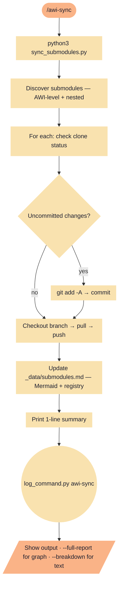

# awi-sync

Sync all AWI submodules (direct + nested). Commits local changes, pulls, pushes, and updates _data/submodules.md.

**Tools:** Bash

> Node shapes and colors: see [_legend.md](_legend.md)

## Flow

