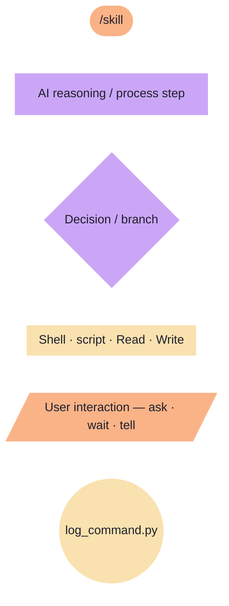

# Diagram Legend

All skill flowcharts use the same node shapes and Catppuccin Mocha colors.

## Colors

| Color | Class | Meaning |
|-------|-------|---------|
| 🟣 Purple | `ai` | AI — reasoning, decisions, content generation |
| 🟡 Yellow | `det` | Deterministic code — scripts, shell, file I/O, logging |
| 🟠 Orange | `human` | Human — skill invocation and user output |

## Shapes

| Shape | Syntax | Meaning |
|-------|--------|---------|
| Stadium | `([text])` | Entry point — the `/skill` invocation |
| Rectangle | `[text]` | Process step or STOP/BLOCK |
| Diamond | `{text}` | Decision / conditional branch |
| Subroutine | `[[text]]` | Tool call — Read, Grep, Glob, Write, Edit, Bash |
| Parallelogram | `[/text/]` | User interaction — ask / wait / tell |
| Circle | `((text))` | Log invocation (end of every skill) |

## Example

