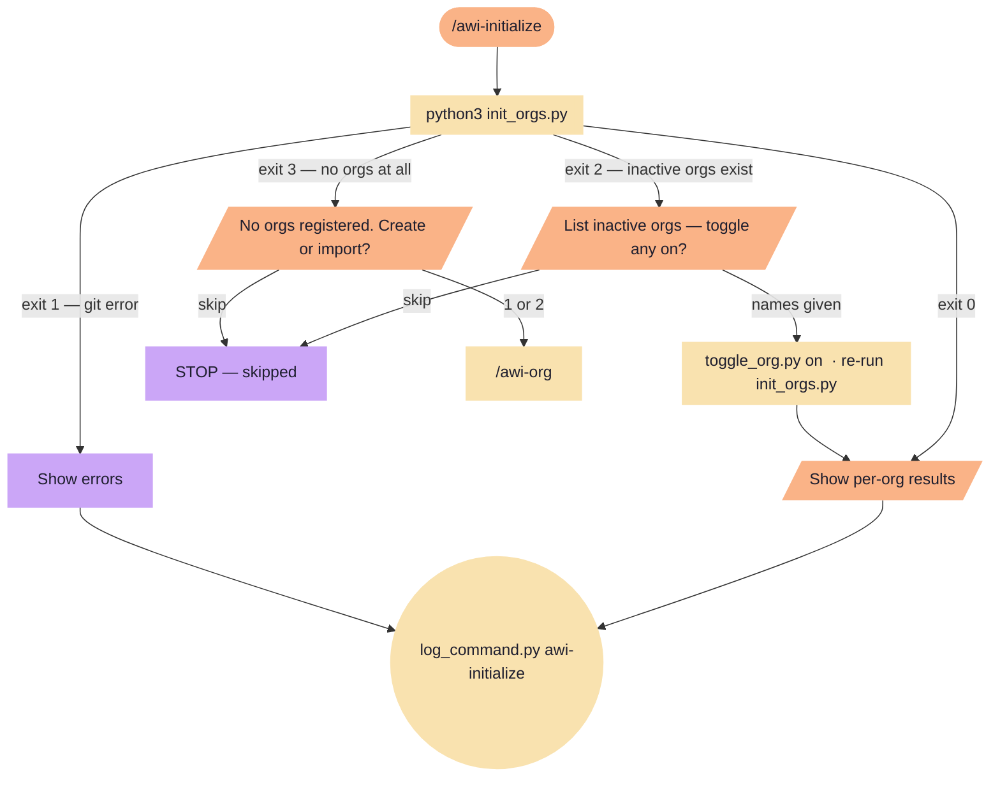

# awi-initialize

Initialize all org submodules that are toggled on. Reads the current user's
`active-orgs.json`, registers any unregistered orgs in `.gitmodules`, then
runs `git submodule update --init` for each.

**Tools:** Bash

> Node shapes and colors: see [_legend.md](_legend.md)

## Flow

