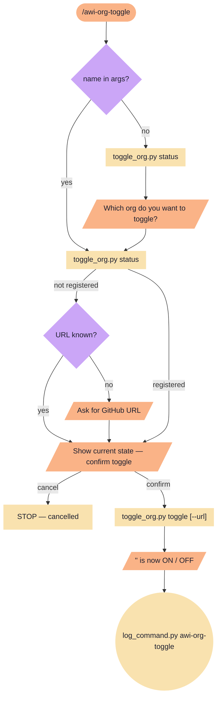

# awi-org-toggle

Toggle an org submodule on or off. State persists in `_data/users/<github-id>/active-orgs.json`.

**Tools:** Bash

> Node shapes and colors: see [_legend.md](_legend.md)

## Flow

