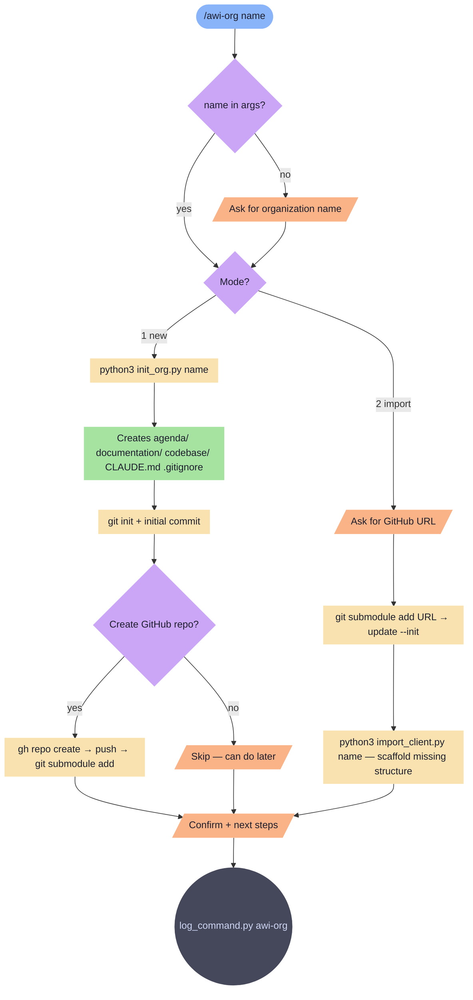

# awi-org

Add an organization workspace under `_data/organizations/<name>/` — create from scratch or import from GitHub.

**Tools:** Bash, Write

> Node shapes and colors: see [_legend.md](_legend.md)

## Flow

