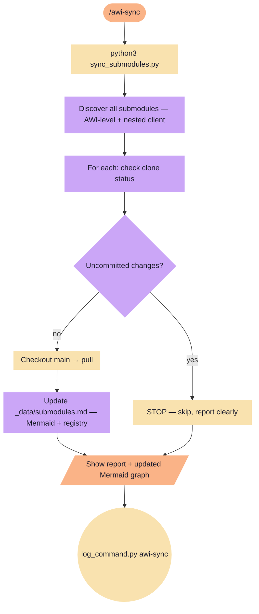

# awi-sync

Sync all AWI submodules (direct + nested). Pulls main, skips dirty repos, updates _data/submodules.md.

**Tools:** Bash, Write, Edit

> Node shapes and colors: see [_legend.md](_legend.md)

## Flow

