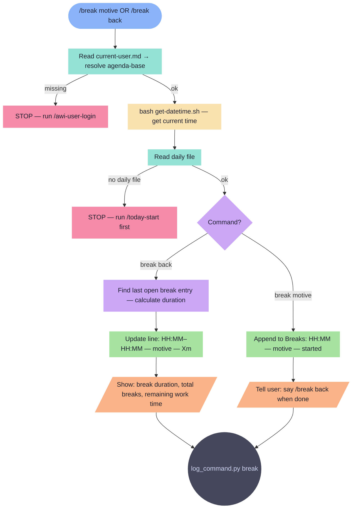

# break

Log a break to today's daily file. Tracks start/end and motive for accurate work time calculation.

**Tools:** Read, Write, Edit, Bash

> Node shapes and colors: see [_legend.md](_legend.md)

## Flow

