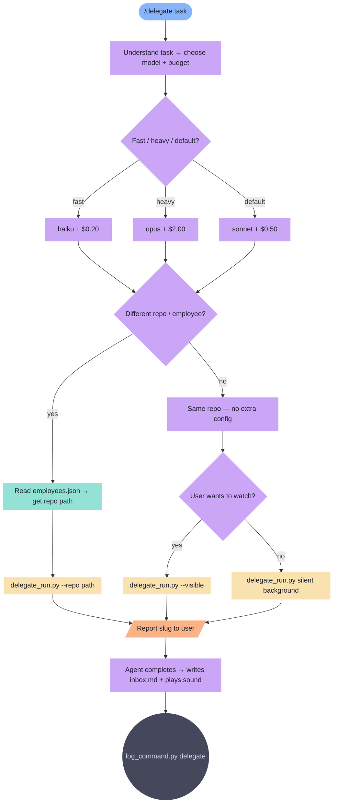

# delegate

Delegate a task to a background agent. Runs silently; reports back via inbox on next message.

**Tools:** Bash, Read

> Node shapes and colors: see [_legend.md](_legend.md)

## Flow

```mermaid
graph TD
    A(["/delegate task"]) --> B[Understand task → choose model + budget]
    B --> C{Fast / heavy / default?}
    C -->|fast| D[haiku + $0.20]
    C -->|heavy| E[opus + $2.00]
    C -->|default| F[sonnet + $0.50]
    D --> G{Different repo / employee?}
    E --> G
    F --> G
    G -->|yes| H[[Read employees.json → get repo path]]
    G -->|no| I[Same repo — no extra config]
    H --> J[[delegate_run.py --repo path]]
    I --> K{User wants to watch?}
    K -->|yes| L[[delegate_run.py --visible]]
    K -->|no| M[[delegate_run.py silent background]]
    J --> N[/Report slug to user/]
    L --> N
    M --> N
    N --> O[Agent completes → writes inbox.md + plays sound]
    O --> P((log_command.py delegate))

    classDef entry  fill:#89b4fa,color:#1e1e2e,stroke:#89b4fa
    classDef ai     fill:#cba6f7,color:#1e1e2e,stroke:#cba6f7
    classDef read   fill:#94e2d5,color:#1e1e2e,stroke:#94e2d5
    classDef write  fill:#a6e3a1,color:#1e1e2e,stroke:#a6e3a1
    classDef shell  fill:#f9e2af,color:#1e1e2e,stroke:#f9e2af
    classDef user   fill:#fab387,color:#1e1e2e,stroke:#fab387
    classDef stop   fill:#f38ba8,color:#1e1e2e,stroke:#f38ba8
    classDef log    fill:#45475a,color:#cdd6f4,stroke:#45475a

    class A entry
    class B,C,G,K ai
    class D,E,F,I ai
    class H read
    class J,L,M shell
    class N user
    class O ai
    class P log
```
