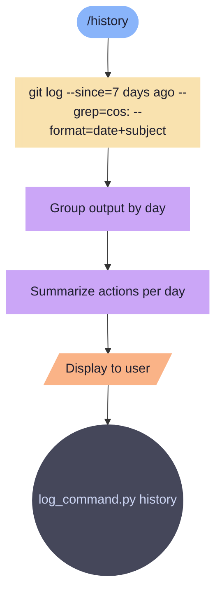

# history

Show recent git activity (last 7 days) in readable format, grouped by day.

**Tools:** Bash

> Node shapes and colors: see [_legend.md](_legend.md)

## Flow

```mermaid
graph TD
    A(["/history"]) --> B[["git log --since=7 days ago --grep=cos: --format=date+subject"]]
    B --> C[Group output by day]
    C --> D[Summarize actions per day]
    D --> E[/Display to user/]
    E --> F((log_command.py history))

    classDef entry  fill:#89b4fa,color:#1e1e2e,stroke:#89b4fa
    classDef ai     fill:#cba6f7,color:#1e1e2e,stroke:#cba6f7
    classDef read   fill:#94e2d5,color:#1e1e2e,stroke:#94e2d5
    classDef write  fill:#a6e3a1,color:#1e1e2e,stroke:#a6e3a1
    classDef shell  fill:#f9e2af,color:#1e1e2e,stroke:#f9e2af
    classDef user   fill:#fab387,color:#1e1e2e,stroke:#fab387
    classDef stop   fill:#f38ba8,color:#1e1e2e,stroke:#f38ba8
    classDef log    fill:#45475a,color:#cdd6f4,stroke:#45475a

    class A entry
    class B shell
    class C,D ai
    class E user
    class F log
```
