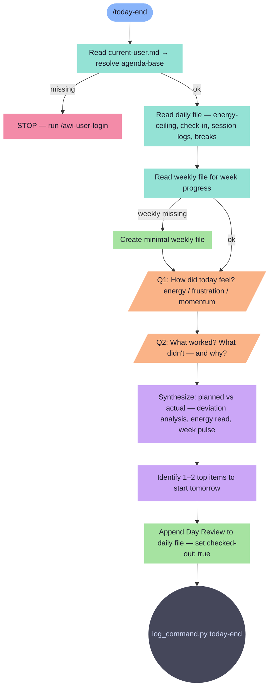

# today-end

End-of-day retrospective. Reviews planned vs actual, energy, week pulse, and tomorrow's handoff.

**Tools:** Read, Write, Edit, Bash, Glob

> Node shapes and colors: see [_legend.md](_legend.md)

## Flow

