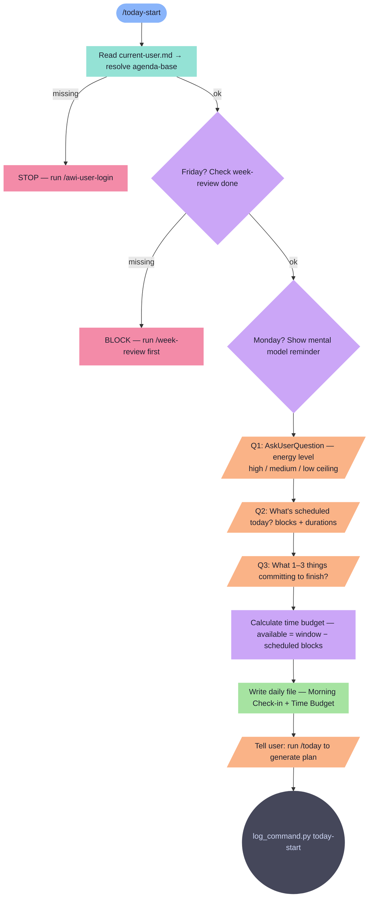

# today-start

Morning intake ritual. Captures energy, schedule, and commitments — writes check-in to daily file.

**Tools:** Read, Write, Edit, Bash

> Node shapes and colors: see [_legend.md](_legend.md)

## Flow

