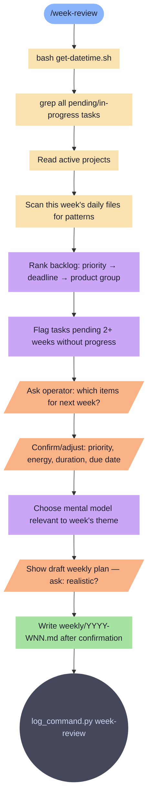

# week-review

Friday ritual. Review full backlog, re-rank priorities, select next week's work batch.

**Tools:** Read, Write, Bash, Grep

> Node shapes and colors: see [_legend.md](_legend.md)

## Flow

