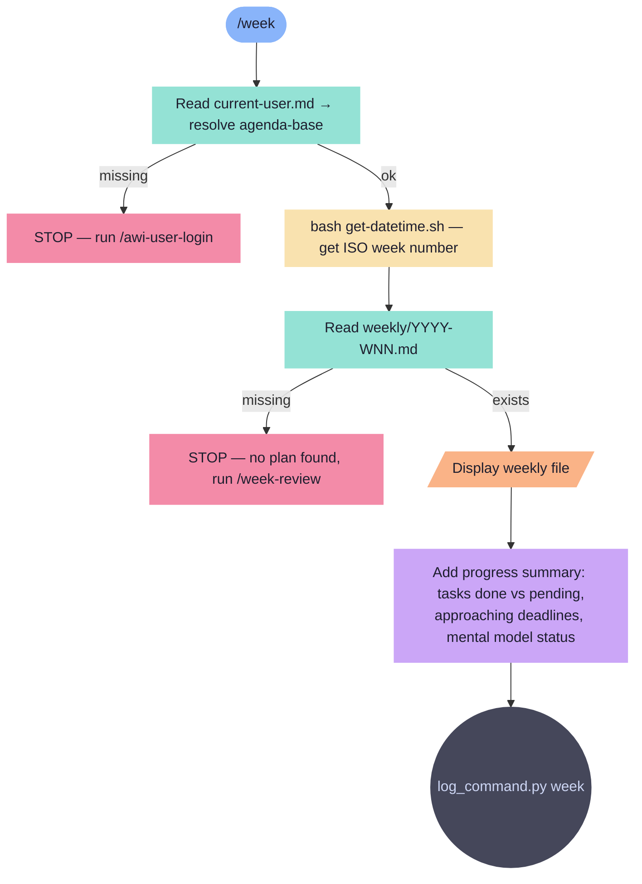

# week

Display current week's plan. Read-only view — use /week-review to create or update.

**Tools:** Read, Bash

> Node shapes and colors: see [_legend.md](_legend.md)

## Flow

```mermaid
graph TD
    A(["/week"]) --> B[[Read current-user.md → resolve agenda-base]]
    B -->|missing| C["STOP — run /awi-user-login"]
    B -->|ok| D[[bash get-datetime.sh — get ISO week number]]
    D --> E[["Read weekly/YYYY-WNN.md"]]
    E -->|missing| F["STOP — no plan found, run /week-review"]
    E -->|exists| G[/Display weekly file/]
    G --> H[Add progress summary: tasks done vs pending,<br/>approaching deadlines, mental model status]
    H --> I((log_command.py week))

    classDef entry  fill:#89b4fa,color:#1e1e2e,stroke:#89b4fa
    classDef ai     fill:#cba6f7,color:#1e1e2e,stroke:#cba6f7
    classDef read   fill:#94e2d5,color:#1e1e2e,stroke:#94e2d5
    classDef write  fill:#a6e3a1,color:#1e1e2e,stroke:#a6e3a1
    classDef shell  fill:#f9e2af,color:#1e1e2e,stroke:#f9e2af
    classDef user   fill:#fab387,color:#1e1e2e,stroke:#fab387
    classDef stop   fill:#f38ba8,color:#1e1e2e,stroke:#f38ba8
    classDef log    fill:#45475a,color:#cdd6f4,stroke:#45475a

    class A entry
    class B,E read
    class C,F stop
    class D shell
    class G user
    class H ai
    class I log
```
