# wrap-session

End-of-session ritual. Session summary, daily file update, behavioral observations, unsaved info sweep, rename suggestion.

**Tools:** Read, Write, Edit, Bash, Glob

> Node shapes and colors: see [_legend.md](_legend.md)

## Flow

```mermaid
graph TD
    A(["/wrap-session"]) --> B[Summarize session — 3–6 bullet recap]
    B --> C[[Read current-user.md → resolve agenda-base]]
    C --> D[[Read or create today's daily file]]
    D --> E[["Append Session Log — Completed + Added + Impulse check"]]
    E --> F[["gh api user → get github-id, login, name"]]
    F --> G[["ls _data/users/github-id/inference/ → read recent entries"]]
    G --> H[Write 1–3 observations — Pros + Cons required for each]
    H --> I{Self-stated preferences this session?}
    I -->|yes| J[["Append to _data/users/github-id.md § Preferences"]]
    I -->|no| K[Skip]
    J --> L{Pattern graduated to stable?}
    K --> L
    L -->|yes| M[["Move to Long-term patterns"]]
    L -->|no| N[/Tell user all observations out loud/]
    M --> N
    N --> O[Scan for unsaved info — tasks, decisions, outputs, people]
    O --> P[/Ask: file each item now or skip?/]
    P --> Q[/"Check session title — suggest /rename if untitled"/]
    Q --> R((log_command.py wrap-session))

    classDef entry  fill:#89b4fa,color:#1e1e2e,stroke:#89b4fa
    classDef ai     fill:#cba6f7,color:#1e1e2e,stroke:#cba6f7
    classDef read   fill:#94e2d5,color:#1e1e2e,stroke:#94e2d5
    classDef write  fill:#a6e3a1,color:#1e1e2e,stroke:#a6e3a1
    classDef shell  fill:#f9e2af,color:#1e1e2e,stroke:#f9e2af
    classDef user   fill:#fab387,color:#1e1e2e,stroke:#fab387
    classDef stop   fill:#f38ba8,color:#1e1e2e,stroke:#f38ba8
    classDef log    fill:#45475a,color:#cdd6f4,stroke:#45475a

    class A entry
    class B,H,O ai
    class C,D,G read
    class E,J,M write
    class F shell
    class I,L ai
    class K ai
    class N,P,Q user
    class R log
```

