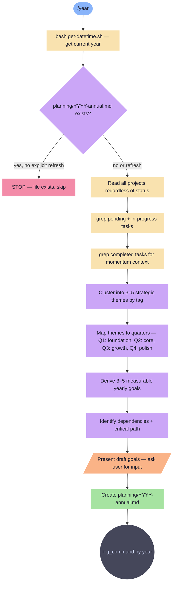

# year

Generate yearly plan with strategic goals, quarterly targets, and project roadmap.

**Tools:** Read, Write, Bash, Grep

> Node shapes and colors: see [_legend.md](_legend.md)

## Flow

```mermaid
graph TD
    A(["/year"]) --> B[[bash get-datetime.sh — get current year]]
    B --> C{planning/YYYY-annual.md exists?}
    C -->|yes, no explicit refresh| D["STOP — file exists, skip"]
    C -->|no or refresh| E[[Read all projects regardless of status]]
    E --> F[[grep pending + in-progress tasks]]
    F --> G[[grep completed tasks for momentum context]]
    G --> H[Cluster into 3–5 strategic themes by tag]
    H --> I[Map themes to quarters — Q1: foundation, Q2: core, Q3: growth, Q4: polish]
    I --> J[Derive 3–5 measurable yearly goals]
    J --> K[Identify dependencies + critical path]
    K --> L[/Present draft goals — ask user for input/]
    L --> M[["Create planning/YYYY-annual.md"]]
    M --> N((log_command.py year))

    classDef entry  fill:#89b4fa,color:#1e1e2e,stroke:#89b4fa
    classDef ai     fill:#cba6f7,color:#1e1e2e,stroke:#cba6f7
    classDef read   fill:#94e2d5,color:#1e1e2e,stroke:#94e2d5
    classDef write  fill:#a6e3a1,color:#1e1e2e,stroke:#a6e3a1
    classDef shell  fill:#f9e2af,color:#1e1e2e,stroke:#f9e2af
    classDef user   fill:#fab387,color:#1e1e2e,stroke:#fab387
    classDef stop   fill:#f38ba8,color:#1e1e2e,stroke:#f38ba8
    classDef log    fill:#45475a,color:#cdd6f4,stroke:#45475a

    class A entry
    class B,E,F,G shell
    class C ai
    class D stop
    class H,I,J,K ai
    class L user
    class M write
    class N log
```
