# Diagram Legend

All skill flowcharts use the same node shapes and Catppuccin Mocha colors.

## Shapes

| Shape | Syntax | Meaning |
|-------|--------|---------|
| 🔵 Stadium | `([text])` | Entry point — the `/skill` invocation |
| 🟣 Rectangle | `[text]` | AI reasoning, analysis, ordering |
| 🟣 Diamond | `{text}` | Decision / conditional branch |
| 🩵 Subroutine | `[[text]]` | Read tool — Read, Grep, Glob |
| 🟢 Subroutine | `[[text]]` | Write tool — Write, Edit |
| 🟡 Subroutine | `[[text]]` | Shell — Bash, git, gh, python3 |
| 🟠 Parallelogram | `[/text/]` | User interaction — ask / wait / tell |
| 🔴 Rectangle | `[text]` | STOP / BLOCK / error gate |
| ⚫ Circle | `((text))` | Log invocation (end of every skill) |

## Colors

```mermaid
graph TD
    A(["🔵 Entry — /skill invocation"])
    B["🟣 AI reasoning / process step"]
    C{🟣 Decision / branch}
    D[["🩵 Read tool — Read · Grep · Glob"]]
    E[["🟢 Write tool — Write · Edit"]]
    F[["🟡 Shell — Bash · git · gh · python3"]]
    G[/"🟠 User interaction — ask · wait · tell"/]
    H["🔴 STOP / BLOCK / error"]
    I(("⚫ log_command.py"))

    classDef entry  fill:#89b4fa,color:#1e1e2e,stroke:#89b4fa
    classDef ai     fill:#cba6f7,color:#1e1e2e,stroke:#cba6f7
    classDef read   fill:#94e2d5,color:#1e1e2e,stroke:#94e2d5
    classDef write  fill:#a6e3a1,color:#1e1e2e,stroke:#a6e3a1
    classDef shell  fill:#f9e2af,color:#1e1e2e,stroke:#f9e2af
    classDef user   fill:#fab387,color:#1e1e2e,stroke:#fab387
    classDef stop   fill:#f38ba8,color:#1e1e2e,stroke:#f38ba8
    classDef log    fill:#45475a,color:#cdd6f4,stroke:#45475a

    class A entry
    class B,C ai
    class D read
    class E write
    class F shell
    class G user
    class H stop
    class I log
```

