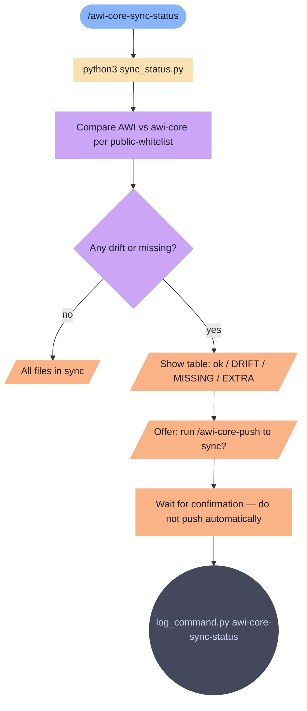

# awi-core-sync-status

Report sync status between AWI (private) and awi-core (public forkable repo).

**Tools:** Bash

> Node shapes and colors: see [_legend.md](_legend.md)

## Flow

```mermaid
graph TD
    A(["/awi-core-sync-status"]) --> B[[python3 sync_status.py]]
    B --> C[Compare AWI vs awi-core per public-whitelist]
    C --> D{Any drift or missing?}
    D -->|no| E[/All files in sync/]
    D -->|yes| F[/"Show table: ok / DRIFT / MISSING / EXTRA"/]
    F --> G[/"Offer: run /awi-core-push to sync?"/]
    G --> H[Wait for confirmation — do not push automatically]
    H --> I((log_command.py awi-core-sync-status))

    classDef entry  fill:#89b4fa,color:#1e1e2e,stroke:#89b4fa
    classDef ai     fill:#cba6f7,color:#1e1e2e,stroke:#cba6f7
    classDef read   fill:#94e2d5,color:#1e1e2e,stroke:#94e2d5
    classDef write  fill:#a6e3a1,color:#1e1e2e,stroke:#a6e3a1
    classDef shell  fill:#f9e2af,color:#1e1e2e,stroke:#f9e2af
    classDef user   fill:#fab387,color:#1e1e2e,stroke:#fab387
    classDef stop   fill:#f38ba8,color:#1e1e2e,stroke:#f38ba8
    classDef log    fill:#45475a,color:#cdd6f4,stroke:#45475a

    class A entry
    class B shell
    class C,D ai
    class E,F,G,H user
    class I log
```
