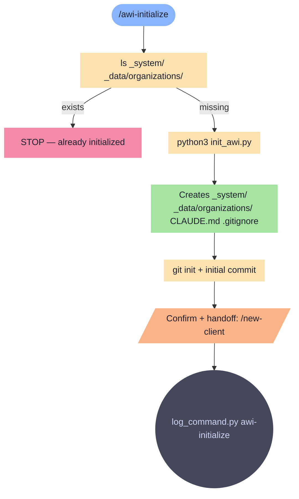

# awi-initialize

Bootstrap AWI repo file structure from scratch. Run once after /awi-introduction.

**Tools:** Bash, Write

> Node shapes and colors: see [_legend.md](_legend.md)

## Flow

```mermaid
graph TD
    A(["/awi-initialize"]) --> B[["ls _system/ _data/organizations/"]]
    B -->|exists| C["STOP — already initialized"]
    B -->|missing| D[[python3 init_awi.py]]
    D --> E[["Creates _system/ _data/organizations/ CLAUDE.md .gitignore"]]
    E --> F[[git init + initial commit]]
    F --> G[/"Confirm + handoff: /new-client"/]
    G --> H((log_command.py awi-initialize))

    classDef entry  fill:#89b4fa,color:#1e1e2e,stroke:#89b4fa
    classDef ai     fill:#cba6f7,color:#1e1e2e,stroke:#cba6f7
    classDef read   fill:#94e2d5,color:#1e1e2e,stroke:#94e2d5
    classDef write  fill:#a6e3a1,color:#1e1e2e,stroke:#a6e3a1
    classDef shell  fill:#f9e2af,color:#1e1e2e,stroke:#f9e2af
    classDef user   fill:#fab387,color:#1e1e2e,stroke:#fab387
    classDef stop   fill:#f38ba8,color:#1e1e2e,stroke:#f38ba8
    classDef log    fill:#45475a,color:#cdd6f4,stroke:#45475a

    class A entry
    class B,D,F shell
    class C stop
    class E write
    class G user
    class H log
```
