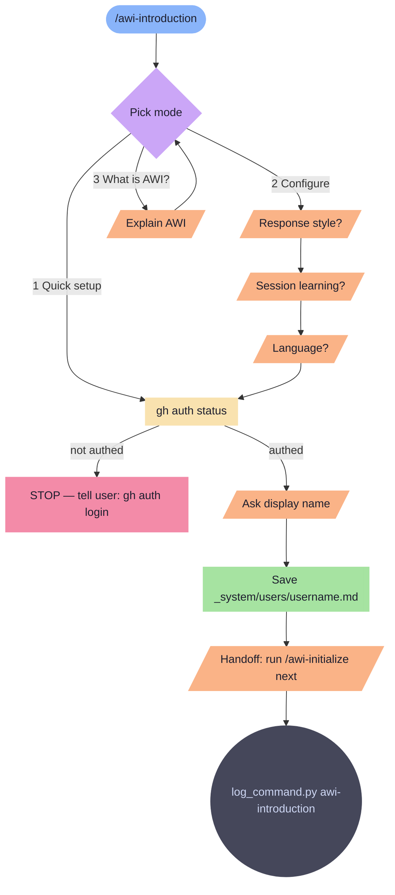

# awi-introduction

First-time AWI onboarding. Links GitHub account, sets language, response style, and session learning. Creates user profile.

**Tools:** Bash, Write

> Node shapes and colors: see [_legend.md](_legend.md)

## Flow

