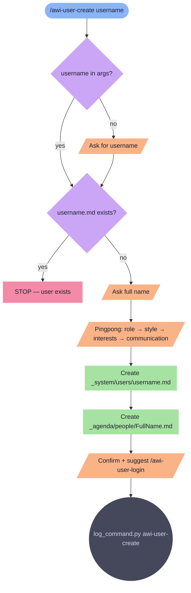

# awi-user-create

Create new AWI vault user and linked person profile via interactive Q&A.

**Tools:** Read, Write, Bash, Glob

> Node shapes and colors: see [_legend.md](_legend.md)

## Flow

```mermaid
graph TD
    A(["/awi-user-create username"]) --> B{username in args?}
    B -->|no| C[/Ask for username/]
    B -->|yes| D{username.md exists?}
    C --> D
    D -->|yes| E["STOP — user exists"]
    D -->|no| F[/Ask full name/]
    F --> G[/Pingpong: role → style → interests → communication/]
    G --> H[["Create _system/users/username.md"]]
    H --> I[["Create _agenda/people/FullName.md"]]
    I --> J[/"Confirm + suggest /awi-user-login"/]
    J --> K((log_command.py awi-user-create))

    classDef entry  fill:#89b4fa,color:#1e1e2e,stroke:#89b4fa
    classDef ai     fill:#cba6f7,color:#1e1e2e,stroke:#cba6f7
    classDef read   fill:#94e2d5,color:#1e1e2e,stroke:#94e2d5
    classDef write  fill:#a6e3a1,color:#1e1e2e,stroke:#a6e3a1
    classDef shell  fill:#f9e2af,color:#1e1e2e,stroke:#f9e2af
    classDef user   fill:#fab387,color:#1e1e2e,stroke:#fab387
    classDef stop   fill:#f38ba8,color:#1e1e2e,stroke:#f38ba8
    classDef log    fill:#45475a,color:#cdd6f4,stroke:#45475a

    class A entry
    class B,D ai
    class C,F,G,J user
    class E stop
    class H,I write
    class K log
```
