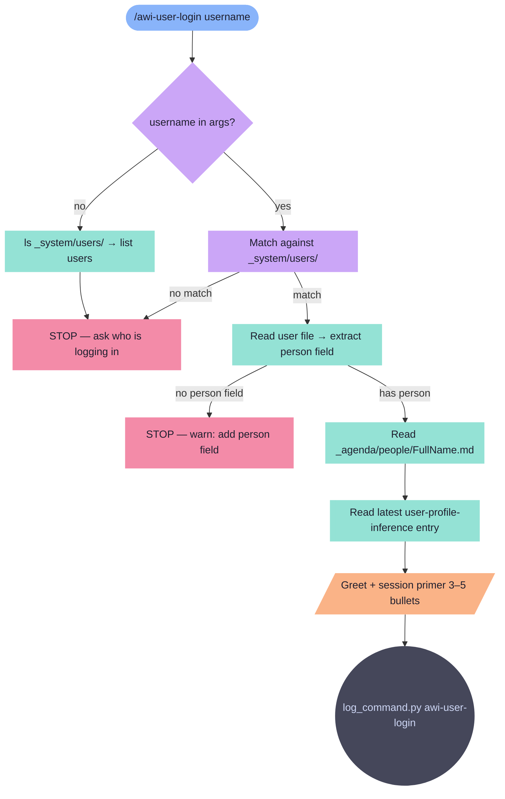

# awi-user-login

Load person profile for the session. Greets by name, primes context from preferences and patterns.

**Tools:** Read, Bash, Glob

> Node shapes and colors: see [_legend.md](_legend.md)

## Flow

