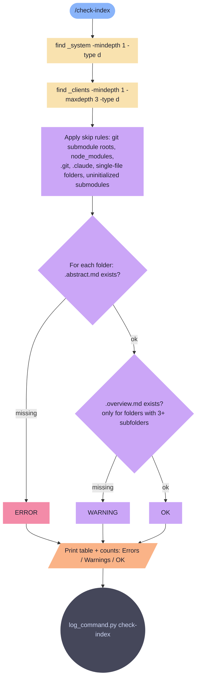

# check-index

Read-only audit of _system/ and _data/organizations/ for missing .abstract.md and .overview.md files.

**Tools:** Bash

> Node shapes and colors: see [_legend.md](_legend.md)

## Flow

