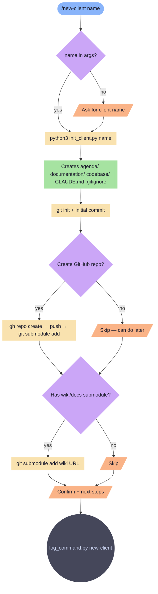

# new-client

Scaffold a new client repo and register as submodule under _data/entities/<name>/.

**Tools:** Bash, Write

> Node shapes and colors: see [_legend.md](_legend.md)

## Flow

```mermaid
graph TD
    A(["/new-client name"]) --> B{name in args?}
    B -->|no| C[/Ask for client name/]
    B -->|yes| D[[python3 init_client.py name]]
    C --> D
    D --> E[["Creates agenda/ documentation/ codebase/ CLAUDE.md .gitignore"]]
    E --> F[[git init + initial commit]]
    F --> G{Create GitHub repo?}
    G -->|yes| H[[gh repo create → push → git submodule add]]
    G -->|no| I[/Skip — can do later/]
    H --> J{Has wiki/docs submodule?}
    I --> J
    J -->|yes| K[[git submodule add wiki URL]]
    J -->|no| L[/Skip/]
    K --> M[/Confirm + next steps/]
    L --> M
    M --> N((log_command.py new-client))

    classDef entry  fill:#89b4fa,color:#1e1e2e,stroke:#89b4fa
    classDef ai     fill:#cba6f7,color:#1e1e2e,stroke:#cba6f7
    classDef read   fill:#94e2d5,color:#1e1e2e,stroke:#94e2d5
    classDef write  fill:#a6e3a1,color:#1e1e2e,stroke:#a6e3a1
    classDef shell  fill:#f9e2af,color:#1e1e2e,stroke:#f9e2af
    classDef user   fill:#fab387,color:#1e1e2e,stroke:#fab387
    classDef stop   fill:#f38ba8,color:#1e1e2e,stroke:#f38ba8
    classDef log    fill:#45475a,color:#cdd6f4,stroke:#45475a

    class A entry
    class B,G,J ai
    class C,I,L,M user
    class D,F,H,K shell
    class E write
    class N log
```
