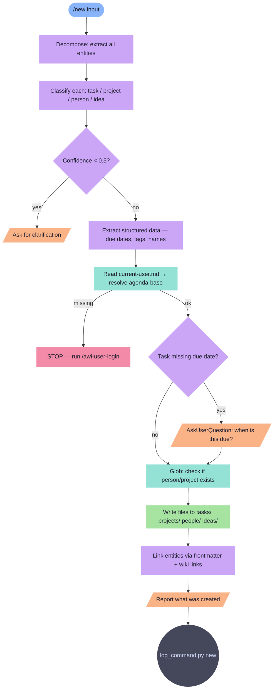

# new

Quick capture — classify and file natural language input into the vault as task, project, person, or idea.

**Tools:** Read, Glob, Write, Edit, AskUserQuestion

> Node shapes and colors: see [_legend.md](_legend.md)

## Flow

