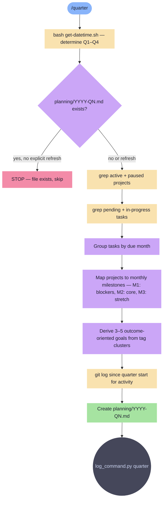

# quarter

Generate quarterly plan with goals, project milestones, and task roadmap.

**Tools:** Read, Write, Bash, Grep

> Node shapes and colors: see [_legend.md](_legend.md)

## Flow

```mermaid
graph TD
    A(["/quarter"]) --> B[[bash get-datetime.sh — determine Q1–Q4]]
    B --> C{planning/YYYY-QN.md exists?}
    C -->|yes, no explicit refresh| D["STOP — file exists, skip"]
    C -->|no or refresh| E[[grep active + paused projects]]
    E --> F[[grep pending + in-progress tasks]]
    F --> G[Group tasks by due month]
    G --> H[Map projects to monthly milestones — M1: blockers, M2: core, M3: stretch]
    H --> I[Derive 3–5 outcome-oriented goals from tag clusters]
    I --> J[[git log since quarter start for activity]]
    J --> K[["Create planning/YYYY-QN.md"]]
    K --> L((log_command.py quarter))

    classDef entry  fill:#89b4fa,color:#1e1e2e,stroke:#89b4fa
    classDef ai     fill:#cba6f7,color:#1e1e2e,stroke:#cba6f7
    classDef read   fill:#94e2d5,color:#1e1e2e,stroke:#94e2d5
    classDef write  fill:#a6e3a1,color:#1e1e2e,stroke:#a6e3a1
    classDef shell  fill:#f9e2af,color:#1e1e2e,stroke:#f9e2af
    classDef user   fill:#fab387,color:#1e1e2e,stroke:#fab387
    classDef stop   fill:#f38ba8,color:#1e1e2e,stroke:#f38ba8
    classDef log    fill:#45475a,color:#cdd6f4,stroke:#45475a

    class A entry
    class B,E,F,J shell
    class C ai
    class D stop
    class G,H,I ai
    class K write
    class L log
```
