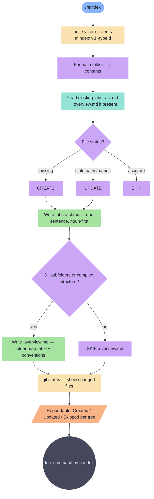

# reindex

Create or update .abstract.md (L0) and .overview.md (L1) files across _system/ and _clients/.

**Tools:** Read, Write, Edit, Bash

> Node shapes and colors: see [_legend.md](_legend.md)

## Flow

