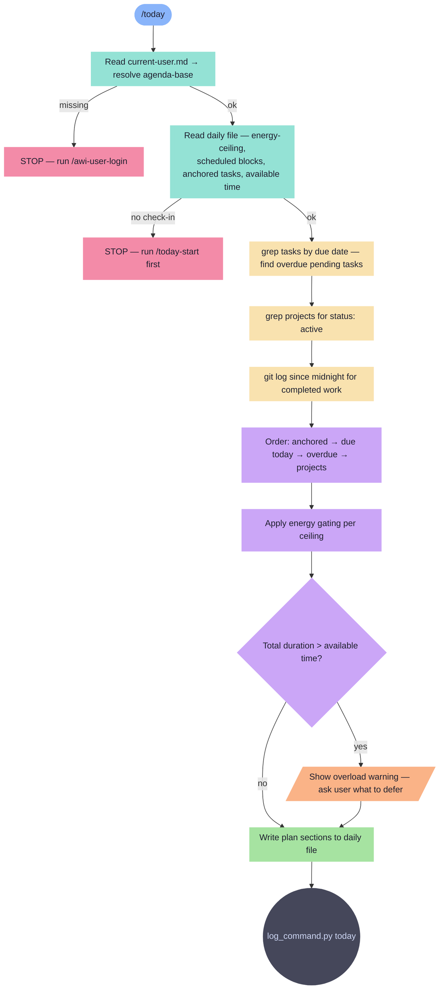

# today

Generate or refresh daily plan from due tasks and active projects. Re-runnable throughout the day.

**Tools:** Read, Write, Edit, Bash, Grep

> Node shapes and colors: see [_legend.md](_legend.md)

## Flow

