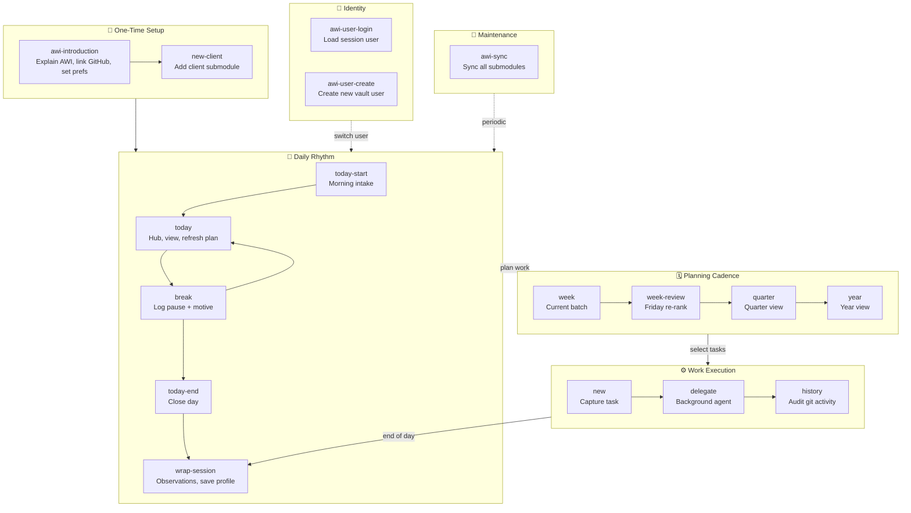

# AWI Skills — Workflow Diagram

<!-- AUTO-GENERATED — edit `_workflow-config.json` and skill frontmatter, not this file -->

## Summary

| Phase | Skills | Cadence |
|---|---|---|
| Setup | awi-introduction → new-client | Once |
| Identity | awi-user-login, awi-user-create | As needed |
| Daily | today-start → today → break → today-end → wrap-session | Every day |
| Planning | week → week-review → quarter → year | Fri / monthly |
| Work | new → delegate → history | Continuous |
| Maintenance | awi-sync | Periodic |
