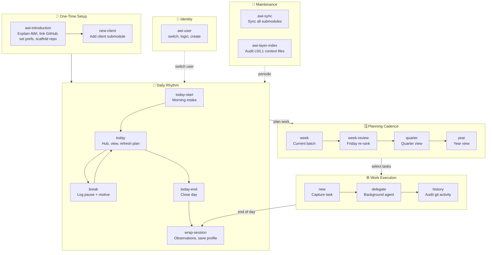

# AWI Skills — Workflow Diagram

## Summary

| Phase | Skills | Cadence |
|---|---|---|
| Setup | awi-introduction → new-client | Once |
| Identity | awi-user | As needed |
| Daily | today-start → today → break → today-end → wrap-session | Every day |
| Planning | week → week-review → quarter → year | Fri / monthly |
| Work | new → delegate → history | Continuous |
| Maintenance | awi-sync, awi-layer-index | Periodic |
